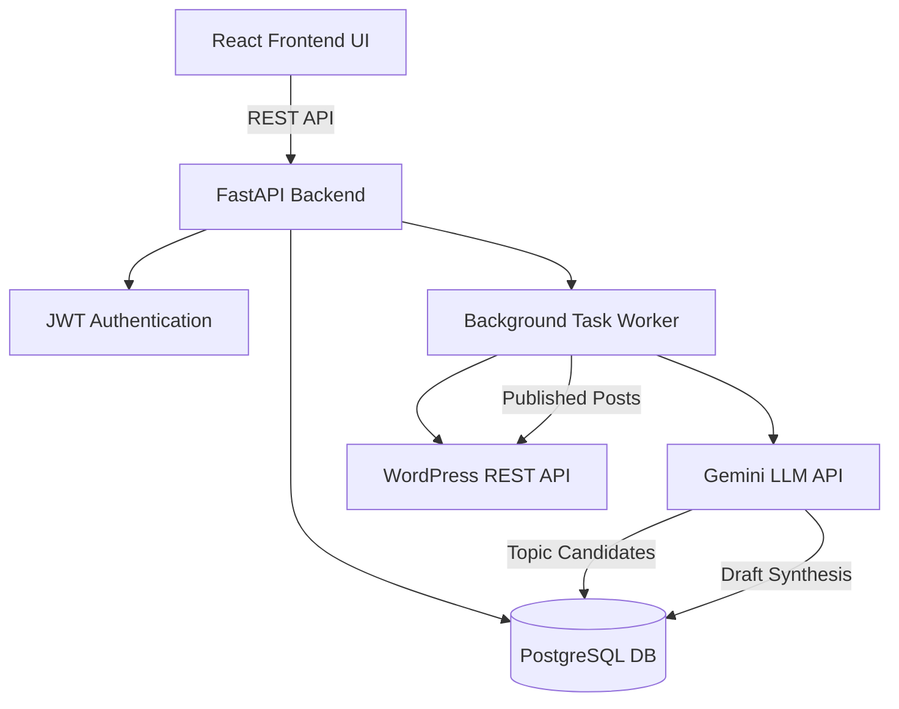
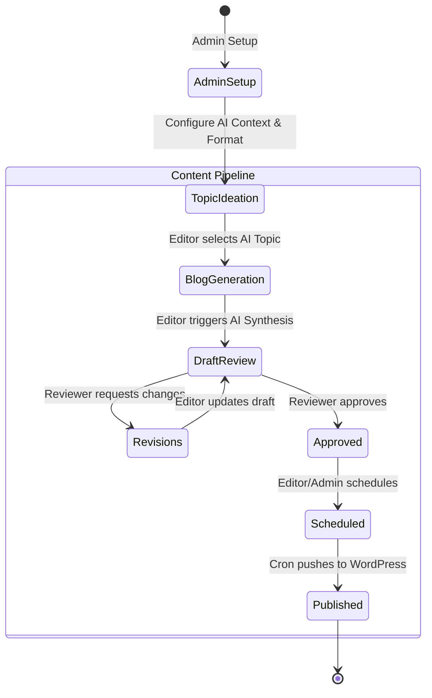
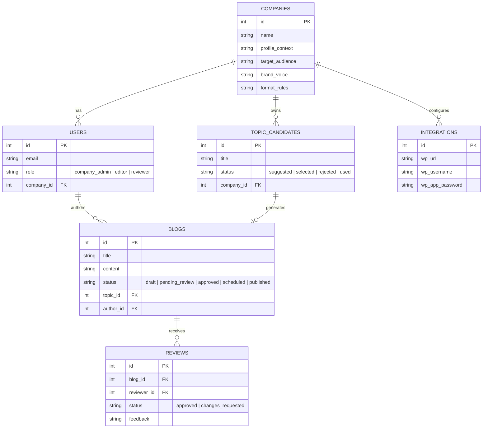

# DailyBlog AI - Assessment Submission

## 1. Solution & Product Requirements Document (PRD)

### Overview
DailyBlog AI is an intelligent, automated blog generation and publishing system designed to solve the content creation bottleneck for B2B and SaaS companies. It completely automates the pipeline from topic ideation to WordPress publishing while maintaining strict editorial governance.

### Key Objectives Achieved
- **Automated Ideation**: AI suggests high-intent topics based on company context and RAG memory.
- **Brand Consistency**: Enforces brand voice, tone, and formatting rules universally.
- **SEO Optimization**: Deterministically generates SEO-friendly titles, meta descriptions, and keywords.
- **Governance**: Implements strict Role-Based Access Control (RBAC) with SoD (Segregation of Duties) across Admins, Editors, and Reviewers.
- **Publishing**: Automated scheduling and pushing to WordPress via REST API.

### User Roles
1. **Company Administrator**: Manages the workspace, configures Company AI Context, Brand Format guidelines, and WordPress integrations.
2. **Editor (Content Manager)**: Generates AI topics, triggers blog synthesis, edits drafts, and submits them for review.
3. **Reviewer (Approver)**: Reviews pending content, requests changes, or approves blogs for scheduling.

---

## 2. System Architecture & High-Level Solution

The system utilizes a modern decoupled architecture:
- **Frontend**: React (Vite), TypeScript, Tailwind CSS. Role-based dynamic routing and dashboards.
- **Backend**: FastAPI (Python), SQLAlchemy (ORM).
- **Database**: PostgreSQL for relational data and state management.
- **AI Engine**: Google Gemini via external LLM provider interface.
- **Background Jobs**: APScheduler for asynchronous AI generation, cron-based scheduling, and WordPress publishing.

---

## 3. Application Workflow & User Journey

---

## 4. Database / ER Diagram

---

## 5. AI Prompt Strategy & Generation Workflow

The AI component uses a **multi-shot, context-injected prompt strategy** to ensure output quality and consistency.

### Topic Generation Strategy
The AI acts as an SEO Content Strategist. It is injected with the `Company Profile` and `Target Audience` to output JSON-formatted topic candidates.
**Sample Prompt:**
> "You are an expert B2B SEO Strategist. Based on the following company profile: {company_profile}, generate 3 high-intent blog topic candidates for {target_audience}. Return the output strictly as a JSON array containing: title, primary_keyword, rationale, and angle."

### Blog Synthesis Strategy
The AI acts as an Expert Copywriter. It receives the `Topic`, `Company Context`, and strict `Brand Voice/Format Guidelines`.
**Sample Prompt:**
> "Write a comprehensive, SEO-optimized blog post on the topic '{topic_title}'. 
> Target Keyword: {primary_keyword}.
> Company Context: {company_context}.
> Brand Voice: {brand_voice}.
> Formatting Rules: {format_rules}.
> Ensure the output contains an H1, multiple H2s, an engaging introduction, and a strong CTA. Output strictly in Markdown format."

---

## 6. API & Integration Approach

### WordPress Publishing
The system integrates with WordPress via the **WordPress REST API Application Passwords**.
- **Authentication**: Uses Basic Auth with App Passwords (securely encrypted in the PostgreSQL database using an `INTEGRATION_SECRET_KEY`).
- **Endpoint**: `POST /wp-json/wp/v2/posts`
- **Payload Mapping**: Maps our Markdown content to HTML (via backend parser), sets the title, excerpt, and publishes automatically via the APScheduler cron job running every minute.

---

## 7. Test Scenarios & Quality Assurance

| Scenario ID | Category | Description | Expected Outcome |
|-------------|----------|-------------|------------------|
| TS-01 | Auth / RBAC | Editor attempts to access WordPress settings. | Redirected to dashboard / Access Denied. |
| TS-02 | AI Generation | Admin triggers topic generation with missing Company Context. | AI generates generic topics or system warns Admin to fill context. |
| TS-03 | Content Flow | Editor submits draft for review. | Status changes to `pending_review`, draft locked for Editor. |
| TS-04 | Governance | Reviewer requests changes on a draft. | Status changes to `changes_requested`, Editor can edit again. |
| TS-05 | Integration | Cron job attempts to publish scheduled blog with invalid WP credentials. | Status changes to `failed`, error logged in DB. |
| TS-06 | End-to-End | Full lifecycle from Topic -> Generation -> Approval -> Publish. | Blog successfully appears live on WordPress. |

---

## 8. Assumptions, Limitations, & Future Enhancements

### Assumptions
- Target publishing platform is WordPress via REST API.
- Users have access to an external LLM API (Google Gemini, OpenAI, etc.).
- Images/media are handled externally or directly inside WordPress post-publishing.

### Limitations
- The AI content generation length is bound by the LLM context window limits.
- Currently supports one WordPress integration per company workspace.

### Future Enhancements
- **Multi-Platform Publishing**: Support for publishing directly to LinkedIn, Medium, or Ghost.
- **Image Generation**: Integrate DALL-E or Midjourney to automatically generate and attach featured images to the blogs.
- **Analytics Loop**: Ingest WordPress/Google Analytics data back into the system to score AI topics based on real-world traffic performance.
