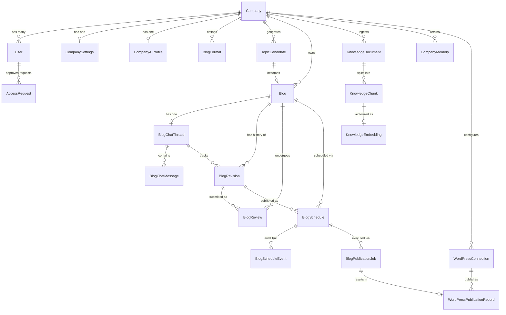

# DailyBlog AI - Entity Relationship Diagram

This document contains the Entity Relationship (ER) diagram for the DailyBlog AI database architecture, mapped from the 19 SQLAlchemy models and 17 Alembic migrations.

## Core Domain Model

## Description of Key Entities

*   **Company (Tenant):** The root of the multi-tenant architecture. Every domain model carries a `company_id` foreign key for strict data isolation.
*   **User:** Contains role-based access control (RBAC) via `UserRole` enum (`COMPANY_ADMIN`, `EDITOR`, `REVIEWER`).
*   **CompanyAIProfile:** Stores brand voice, audience, industry, and marketing goals for the LLM context generation.
*   **KnowledgeDocument / KnowledgeChunk / KnowledgeEmbedding:** The RAG pipeline storage using `pgvector` (384-dimensional embeddings).
*   **Blog / BlogRevision / BlogReview:** The core editorial workflow. Revisions are immutable, append-only records. Reviews enforce Separation of Duties (SoD).
*   **BlogSchedule:** Timezone-aware publication scheduling.
*   **WordPressConnection:** Stores AES-256-GCM encrypted credentials for WordPress integration.
